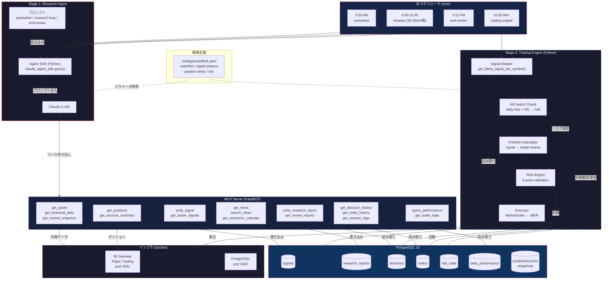
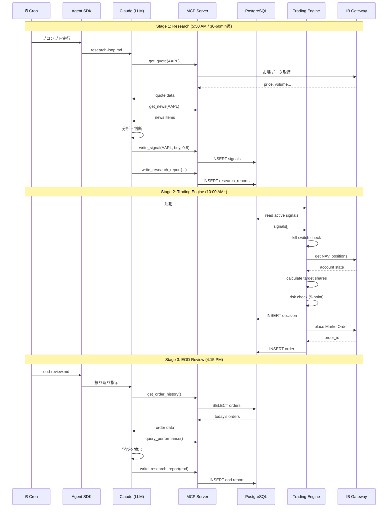

# Claude Trade — AI Trading Platform

AI による自動トレーディングプラットフォーム。Claude が市場分析・シグナル生成を行い、Deterministic な Trading Engine がリスクチェック・発注を実行する。

## システム全体像



## データフロー



## 安全制約

| 制約 | 値 |
|------|-----|
| Trading Mode | Paper Trading のみ |
| Kill Switch | 日次損失 > 3% で自動発動 |
| 最大ポジション | NAV の 10% |
| 最大日次注文数 | 20 |
| シグナル TTL | default 8h / premarket 12h |
| Risk Check | 5-point validation (kill_switch / trading_enabled / position_size / daily_orders / daily_loss) |

## 対応マーケット

| マーケット | 取引所 | 通貨 | 戦略ファイル | Premarket | Intraday (30分毎) | EOD |
|---|---|---|---|---|---|---|
| US | NYSE/NASDAQ | USD | `strategies/us.yaml` | 5:50 ET | 9:05-15:35 ET | 16:15 ET |
| JP | TSE | JPY | `strategies/jp.yaml` | 8:00 JST | 9:05-14:35 JST | 15:15 JST |
| EU | LSE/Euronext | EUR | `strategies/eu.yaml` | 7:00 GMT | 8:05-15:35 GMT | 16:45 GMT |

## セットアップ

```bash
# 初回セットアップ
task setup
# .env を編集 (TWS_USERID, TWS_PASSWORD, FINNHUB_API_KEY)
```

## 実行方法

### 開発環境（tmux 一括起動）

```bash
# tmux で全環境を起動 (Docker インフラ + スケジューラ + ログ + 作業シェル)
task dev

# 後からセッションに接続
task dev:attach
# or: tmux attach -t claude-trade

# 停止
task dev:stop
```

tmux ウィンドウ構成:
| Window | 名前 | 内容 |
|--------|------|------|
| 0 | scheduler | Agent スケジューラ (30分毎に Research + Trading) |
| 1 | logs | Docker コンテナログ |
| 2 | shell | 作業用シェル |
| 3 | db | DB 操作用 |

### 単発実行

```bash
# Research Agent
task research -- intraday --market us
task research -- premarket --market jp
task research -- eod --market eu

# Trading Engine
task trade -- --market us

# DB 確認
task db:signals    # アクティブシグナル一覧
task db:web        # pgweb GUI (http://localhost:8081)
task db:psql       # psql 接続
```

### 全コマンド一覧

```bash
task --list
```

## ドキュメント

- [アーキテクチャ](docs/architecture.md) — システム全体像、コンポーネント、データフロー
- [マルチマーケット対応](docs/markets.md) — 4市場の設定、スケジュール、通貨変換
- [安全制約・リスク管理](docs/safety.md) — Risk Engine、Kill Switch、ポジション管理
- [フィードバックループ](docs/feedback-loop.md) — 自己学習の仕組み、シグナル評価、学びの蓄積
- [データベース](docs/database.md) — テーブル一覧、主要クエリ
- [開発ガイド](docs/development.md) — セットアップ、コマンド、プロジェクト構成
