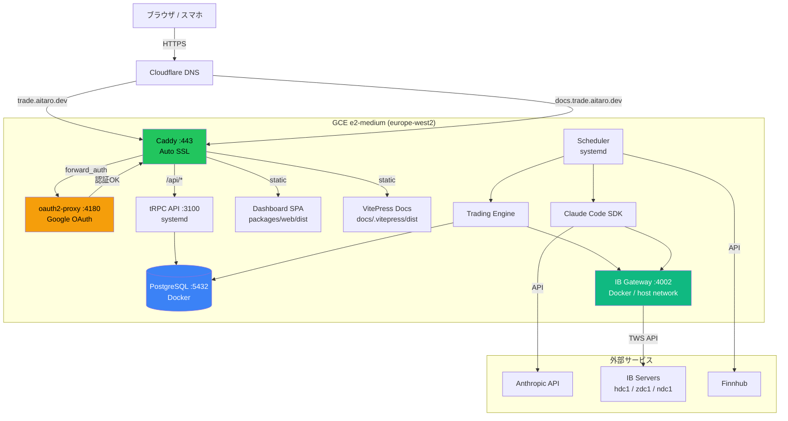
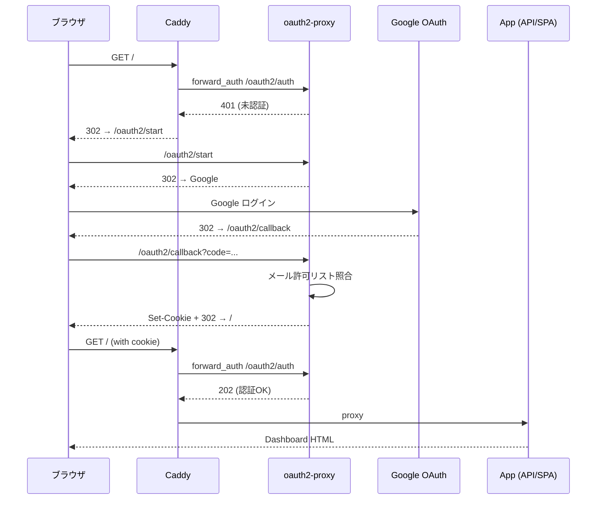
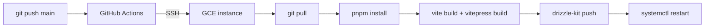

# インフラ構成

## 全体像

## GCE インスタンス

| 項目 | 値 |
|---|---|
| プロジェクト | `aitaro-claude-trade` |
| インスタンス名 | `claude-trade` |
| ゾーン | `europe-west2-a` (London) |
| マシンタイプ | `e2-medium` (1 vCPU, 4GB RAM) |
| OS | Ubuntu 24.04 LTS |
| ディスク | 30GB pd-balanced |
| 静的 IP | `34.13.45.196` |
| 月額 | ~$30 |

## サービス一覧

| サービス | 管理 | ポート | 説明 |
|---|---|---|---|
| Caddy | systemd | 80, 443 | リバースプロキシ + 自動 SSL |
| oauth2-proxy | systemd | 4180 | Google OAuth 認証 |
| tRPC API | systemd | 3100 | バックエンド API |
| Scheduler | systemd | - | Research Agent + Trading Engine の cron 実行 |
| PostgreSQL | Docker | 5432 (localhost) | データベース |
| IB Gateway | Docker (host network) | 4002 | Interactive Brokers API |

## 認証フロー

## ドメイン構成

| ドメイン | 用途 | DNS |
|---|---|---|
| `trade.aitaro.dev` | ダッシュボード + API | Cloudflare A → 34.13.45.196 (DNS only) |
| `docs.trade.aitaro.dev` | ドキュメントサイト | Cloudflare A → 34.13.45.196 (DNS only) |

SSL 証明書は Caddy が Let's Encrypt から自動取得・自動更新。

## デプロイ

GitHub Actions で main push 時に自動デプロイ:

詳細は [deployment.md](./deployment.md) を参照。
