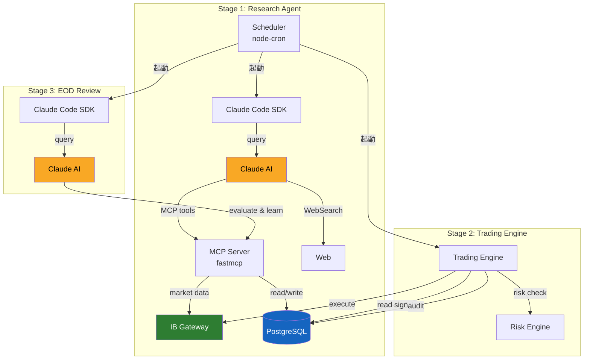
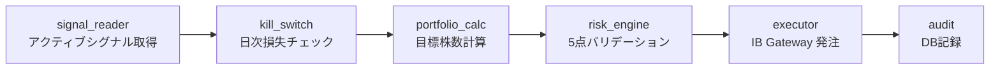

# システムアーキテクチャ

## 全体像



## 設計思想

AI (Claude) が**確率的な判断**（何を買うか）を担当し、TypeScript が**決定論的な処理**（リスクチェック・発注）を担当する。この分離により、AI のミスが直接発注に繋がらない安全設計を実現している。

## コンポーネント

### Agent Runner (`packages/server/src/agent/`)

Claude Code SDK を使って Claude をプログラマティックに起動する。node-cron で各市場のスケジュールを管理し、10分ごとに Research → Trading のサイクルを回す。

| ファイル | 役割 |
|---|---|
| `runner.ts` | Claude Code SDK の `query()` を呼び出し、プロンプト + マーケットコンテキストを注入 |
| `scheduler.ts` | 4市場 × 3タイプ（premarket/intraday/eod）のジョブを管理 |
| `markets.ts` | マーケット定義（時間帯、祝日、取引所、通貨） |
| `market.ts` | 市場開閉判定 |
| `snapshots.ts` | IB からアカウント・ポジションのスナップショットを取得 |

### MCP Server (`packages/server/src/mcp-server/`)

FastMCP (TypeScript版) で構築された Claude 用ツール群。Claude はこれらのツールを呼び出してデータ取得・シグナル書き込みを行う。

| カテゴリ | ツール | 用途 |
|---|---|---|
| Market Data | `get_quote`, `get_historical_data`, `get_market_snapshot` | IB Gateway 経由で株価取得 |
| Portfolio | `get_positions`, `get_account_summary` | ポジション・口座情報 |
| Signals | `write_signal`, `get_active_signals` | シグナルの読み書き |
| Research | `write_research_report`, `get_recent_reports` | レポート保存・参照 |
| News | `get_news`, `search_news`, `get_economic_calendar` | ニュース・経済指標 |
| Audit | `get_decision_history`, `get_order_history`, `get_session_logs` | 取引履歴 |
| Analytics | `query_performance`, `get_trade_stats` | 成績分析 |
| Feedback | `evaluate_signal`, `record_lesson`, `get_relevant_lessons`, `get_signal_accuracy` | 自己学習 |

### Trading Engine (`packages/server/src/trading-engine/`)

DB のシグナルを読み取り、deterministic にリスクチェック・発注を行う。Claude は一切介在しない。



### ログ基盤 (`packages/server/src/lib/logger.ts`)

pino による構造化ロギング。本番 (GCE) では JSON + GCP Cloud Logging の severity マッピング、ローカルでは pino-pretty で整形表示。

## データフロー

```
Research Agent (Claude)
  → MCP: write_signal(AAPL, buy, 0.8, confidence=0.7)
  → DB: signals テーブルに INSERT

Trading Engine (TypeScript)
  → DB: signals テーブルから SELECT (strategy="us", is_active=true, expires_at > now)
  → IB: getNav(), getPositions(), getCurrentPrices()
  → NAV を取引通貨に変換 (JPY → USD/GBP/EUR)
  → portfolio_calc: 目標株数計算
  → risk_engine: 5点チェック
  → IB: placeOrder(MarketOrder)
  → DB: decisions, orders テーブルに INSERT

EOD Review (Claude)
  → MCP: evaluate_signal() で各シグナルの正誤を記録
  → MCP: record_lesson() で学びを DB に保存
  → 翌日の Research で get_relevant_lessons() が学びをプロンプトに注入
```
