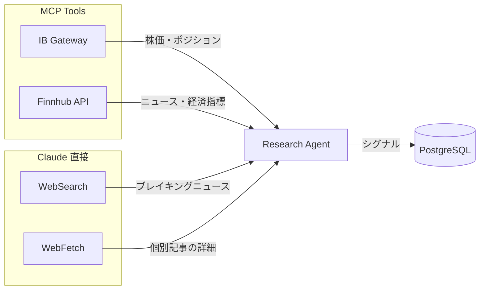

# データソース

Research Agent は3つのデータソースを使い分けて市場分析を行う。

## 1. IB Gateway (マーケットデータ)

Interactive Brokers の TWS API 経由で取得する株価・ポートフォリオデータ。MCP ツールとして Claude に提供。

| ツール | データ | 更新頻度 |
|---|---|---|
| `get_quote` | リアルタイム株価（bid/ask/last/volume） | リクエスト時 |
| `get_historical_data` | OHLCV ローソク足（日足・時間足等） | リクエスト時 |
| `get_market_snapshot` | ウォッチリスト全銘柄の一括スナップショット | リクエスト時 |
| `get_positions` | 保有ポジション一覧 | リクエスト時 |
| `get_account_summary` | NAV, 現金, 買付余力, 含み損益 | リクエスト時 |

### データの種類

- **リアルタイム (Type 1)**: 取引所からのストリーミングデータ。Paper Trading アカウントには無料付与
- **ヒストリカル**: 過去の OHLCV データ。期間・バーサイズを指定して取得
- **フォールバック**: リアルタイムが取得できない場合（市場閉場時、接続不安定時）はヒストリカルデータで分析を継続

### 利用可能な取引所

| 市場 | サブスクリプション | 備考 |
|---|---|---|
| US (NYSE/NASDAQ) | IBKR-PRO Real-Time | 無料 (Paper) |
| EU (Euronext/Xetra) | Alternative European Equities L1 | 無料 (Paper) |
| JP (TSE) | Japan Equities and Derivatives Bundle | 無料 (Paper) |
| UK (LSE) | EU L1 に含まれる | 無料 (Paper) |

## 2. Finnhub API (ニュース・経済指標)

構造化されたニュース・経済指標データ。MCP ツールとして Claude に提供。

| ツール | データ | ソース |
|---|---|---|
| `get_news` | 銘柄別ニュース | Finnhub Company News API |
| `search_news` | マーケット全般ニュース | Finnhub General News API |
| `get_economic_calendar` | 経済指標カレンダー (CPI, FOMC 等) | Finnhub Economic Calendar API |

### 特徴

- **構造化データ**: 見出し・要約・ソース・日時が JSON で返る
- **高速**: API 呼び出し1回で複数記事を取得
- **DB キャッシュ**: 取得したニュースは `news_items` テーブルに保存し、重複取得を防止
- **無料枠**: 60 API calls/minute

## 3. Web (WebSearch / WebFetch)

Claude が直接使うウェブ検索・取得ツール。MCP 経由ではなく Claude Code SDK の組み込みツール。

| ツール | 用途 | 使うタイミング |
|---|---|---|
| WebSearch | ブレイキングニュース検索 | 毎回の intraday リサーチ冒頭 |
| WebFetch | 個別記事の全文取得 | 重要ニュースの詳細確認時 |

### 使い分けのルール（プロンプトで制御）

- **Intraday**: WebSearch は最大3回まで（速度重視）
- **Premarket**: WebSearch は最大10回（深い分析）
- **EOD Review**: WebSearch は必要に応じて（振り返り用）

IB Gateway と Finnhub で構造化データを先に集め、WebSearch は「今日のマクロ急変」と「保有銘柄の異常な値動きの原因調査」に限定する方針。
